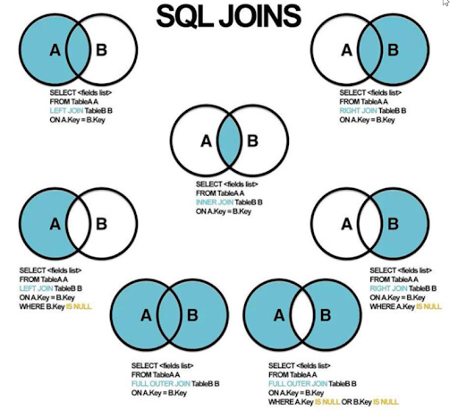
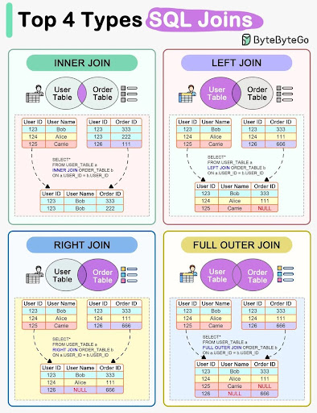
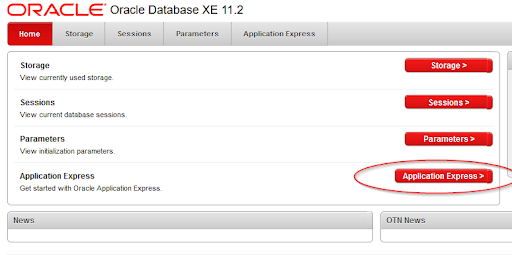
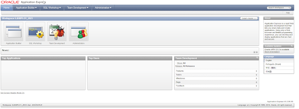

# GUIA MYSQL - ORACLE

## 🔨 | DDL 🡪 Lenguaje de definición de datos

### Estructura

```mysql
Create database (nombreBaseDatos); 🡪 Crear base de datos

Use (nombreBaseDatos); 🡪 Usar base de datos

Create table (nombreTabla); 🡪 Crear la tabla

Drop database(nombreBaseDatos); 🡪 Borrar base de datos
```

#### Dentro de tabla

```mysql
(nombreColumna)(tipoColumna)(cantidadDeCaracteres) PRIMARY KEY;

(nombreColumna)(tipoColumna)(cantidadDeCaracteres)(restricción);
```

#### Tablas con foreign key

1. Se declara las PK:

    ```mysql
    PRIMARY KEY (nombres de columnas que sean FK y PK)
    ```

2. Columnas que vayan a ser FK (deben tener el mismo nombre o nombre similar pero con las mismas caracteristicas de la columna):

    ```mysql
    (nombreColumna)(tipoColumna)(cantidadDeCaracteres)(restricción);
    ```

3. Atributos que vayan a ser FK (deben tener el mismo nombre o nombre similar pero con las mismas caracteristicas del atributo):

    ```mysql
    (nombreColumnaPK)(tipoColumnaPK)( cantidadDeCaracteresPK)
    ```

4. Se crea la FK con la columna anteriormente declarada, se pone una referencia a la columna donde está situada la PK, poner la columna de la PK y por ultimo "on delete cascade on update cascade":
    `mysql
    FOREIGN KEY (nombre columna declarada en esta tabla) REFERENCES (nombreTablaReferenciada)(nombreColumnaDeTablaReferenciada) on delete cascade on update cascade.
    `
    Cuando una tabla tiene dos PK en conjunto (porque es débil), hay dos PK que van juntas por lo que se declara exactamente igual pero con la diferencia explicada en el siguiente ejemplo:

```mysql
PRIMARY KEY (nombrePKyFK1, nombrePKyFK2, nombrePKyFK3)
```

### Edición de las tablas

```mysql
RENAME TABLE (nombreTabla) TO (nombreNuevoTabla) 🡪 Para cambiar el nombre de una tabla por otro

Show tables; 🡪 Nos muestra las tablas creadas

Desc  (nombreTabla); 🡪 Obtenemos la información de la tabla nombrada

Drop table (nombreTabla); 🡪 Eliminar la tabla nombrada

ALTER TABLE (nombreTabla) 🡪 Encabezado para hacer cambios en la tabla nombrada

change column (nombre de la columna que queremos cambiar) (nombre de la columna nueva que queremos introducir)(tipo de columna junto con cantidad de caracteres o restricciones)

Drop  (lo que deseemos eliminar);🡪 Eliminar

Add  (lo que deseemos añadir); 🡪 podemos añadir column, o foreign key o ambas. O una primary key

```

### Tipos de columnas

- (nombreColumna) **char** (cantidad de caracteres fija) 🡪 Se utiliza para una cadena de caracteres con valor fijo. Debe contener tantos caracteres como cantidad hayamos puesto. Ejemplo:

```mysql
DNI char (9) 🡪 Pongo “9” porque el DNI continene 9 caracteres exactos, no puede contener ni más ni menos
```

- (nombreColumna) **decimal** (CantidadEnNumeroDeParteEntera.CantidadEnNumeroDeParteDecimal) 🡪 para introducir un número decimal. La parte entera debe ser mayor siempre que la decimal.

- (nombreColumna) **float** (CantidadEnNumeroDeParteEntera, CantidadEnNumeroDeParteDecimal) 🡪 para introducir números decimales. Es más flexible que decimal y te permite poner la parte entera menor que la decimal.

- (nombreColumna) **int** (cantidad de números)🡪 se utiliza para poner números enteros, si pones, 9, podría ser un número de telefono que tiene 9 números.

- (nombreColumna) **varchar** (cantidad de caracteres variable) 🡪 Se utiliza para una cadena de caracteres que pueda variar la cantidad. Se pone una estimación de caracteres para no quedarnos cortos. Ejemplo:

```mysql
apellidos varchar (20) 🡪 pongo “20” para que quepan 20 caracteres o menos, si no estamos seguros de que nos vaya a ocupar 20 y nos pueda ocupar más ponemos más caracteres como por ejemplo “30”. Pero si ocupa menos de 20, no pasaría nada.
```

- (nombreColumna) **enum** (‘Almería’ ,’Murcia’) 🡪 Se pone la lista de elementos que se pueden poner, se ponen tal cual estan escritos dentro del parentesis. Si pone “Almería” se debe poner exactamente igual, con su tilde y su mayúscula. No valdría “almeria” ni “Almeria”, por ejemplo.

- (nombreColumna) **date** 🡪 se utiliza para las fechas formato (aaa/mm/dd)
- (nombreColumna) **time** 🡪 se utiliza para la hora.
- (nombreColumna) **datetime** 🡪 se utiliza para mostrar tanto la fecha como la hora.
  - Cuando queramos poner el tiempo por defecto del sistema, deberemos poner:
    (nombreColumna) **datetime default now()**; 🡪 se utiliza para la fecha y hora.

#### Tipos de restricciones

**unique** 🡪 no se puede repetir el valor

**not null** 🡪 no puede ir vacío

**default** 🡪 valor por defecto. Ejemplo:

```mysql
(nombreColumna) (tipoColumna Ej: date/time/int…) ('cantidad de caracteres') default 'valor por defecto';
```

**check** 🡪 Ejemplos:

Estos dos siguientes son las formas de hacerlo, una u otra es lo mismo:

(NombreAtributo) (tipoAtribto Ej: date/time/int…) **check** ((NombreAtributo) **between** ('1500' and '2000'))

(NombreAtributo) **int check** ((NombreAtributo)>0 **and** (NombreAtributo)<2000)

Puede ser tambien:

Esto es para indicar que la fecha de salida debe ser despues de la fecha de entrada:
fecha_Salida **date**, **check** (fecha_Salida > fecha_Entrada)

**Constraint** 🡪 lo que hace es crear una variable que se guarda en el sistema con la restriccion o la indicación que le estas poniendo. Ejemplo:

```mysql
CONSTRAINT reserva_PK PRIMARY KEY (refViv, DNI_cliente,f_Ent)
```

#### Indices

Es una forma de acceder de forma rápida a los datos de una tabla. Te ayuda a llegar a un dato concreto de tu estructura osea a una columna.

Si queremos crear un indice se hace lo siguiente:

```mysql
Create INDEX (nombreIndice) ON NOMBRETABLA (nombreColumna entre parentesis);
```

Otra manera es:

```mysql
ALTER TABLE NOMBRE TABLA
ADD INDEX (nombreIndice) ON (nombreColumna entre parentesis);
```

Si queremos crear un indice dentro de una tabla se hace lo siguiente:

```mysql
Create table (NOMBRETABLA) (
(nombreColumna) (tipoColumna) (cantidadCaracteres) PRIMARY KEY,
(nombreColumna) (tipoColumna)(cantidadCaracteres),
INDEX (nombreIndice) ON NOMBRETABLA (nombreColumnaReferencia)
);
```

Para mostrar un indice se hace lo siguiente:

```mysql
SHOW INDEX FROM (nombreDatabase), (nombreTabla);
```

## DCL 🡪 Lenguaje de Control de Datos

### Usuarios

_Creación de usuario en general para cualquier pc_

```mysql
CREATE USER (nombreUsuario) 🡪 Crea un usuario
IDENTIFIED BY ('clave_acceso') 🡪  Crea la contraseña (la contraseña debe ir entre comillas simples)
```

_Creación de usuario en general para un pc individual_

```mysql
CREATE USER (nombreUsuario)(@localhost) IDENTIFIED BY ('clave_acceso')
```

_Si quiero modificar una contraseña de un usuario se hace con:_

```mysql
ALTER USER 'nombre del usuario que queramos modificarle la contraseña'
IDENTIFIED BY 'nueva contraseña';

```

_Para eliminar un usuario:_

```mysql
DROP USER (NombreUsuario)
```

_Para ver los usuarios (consulta) se puede hacer:_

```mysql
USE mysql
SELECT * FROM user;

O también:

SELECT * FROM mysql.user;
```

_Para dar permisos se usa:_

**GRANT ALL** 🡪 permiso en todos.

**GRANT UPDATE** 🡪 permiso para actualizar contenido de las tablas.

**GRANT DELETE** 🡪 para borrar contenido de las tablas.

**GRANT SELECT** 🡪 para ver el contenido de las tablas.

**GRANT INSERT** 🡪 para meter/insertar contenido en las tablas.

**GRANT CREATE** 🡪 para crear nuevas tablas.

**GRANT DROP** 🡪 para borrar tablas.

```mysql
GRANT (tipoDeGrant) ON (BaseDeDatos.NombreTabla) TO (Usuario a quien quieras darle el permiso); 🡪 Para una tabla en concreto de la base de datos indicada

O también:

GRANT (tipoDeGrant) ON (BaseDeDatos.*) TO (Usuario a quien quieras darle el permiso); 🡪 Para las tablas que contiene la base de datos indicada
```

_Para dar todos los permisos para todas las bases de datos y para todas las tablas sería:_

```mysql
GRANT ALL ON *.* TO (Usuario a quien quieras darle el permiso);
```

_Para ver los GRANTS se usa:_

```mysql
Show Grants for 'usuario';
```

_Para quitar los permisos se hace con **REVOKE**:_

```mysql
REVOKE all privileges grant option from usuario;
```

```mysql
REVOKE (tipoDePrivilegio) on (BaseDeDatos.NombreTabla) from (usuario al que queramos quitarle los permisos);
```

_Para quitar los permisos de borrar a un usuario:_

```mysql
Revoke drop on (BaseDeDatos.NombreTabla) from (usuario al que queramos quitarle los permisos);
```

_Para actualizar los privilegios se utiliza:_

```mysql
FLUSH privileges;
```

### Creación de vista

```mysql
CREATE VIEW  viviendas_almeria  AS SELECT refViv FROM vivienda WHERE provincia = 'Almería';
```

## ✏️ | DML -> Lenguaje de Manejo de Datos

### Inserción de datos

**INSERT INTO** nombreTabla **VALUES** ('Kevin',24518) 🡪 Se introducen los datos de todas las columnas que hay en la tabla. Los datos se deben introducir en orden.

**INSERT INTO** nombreTabla(nombreColumna1, nombreColumna2) **VALUES** ('Kevin',656432817), ('Cristina',61234567) 🡪 Se especifican las columnas que se quieren rellenar.

También se puede insertar en una tabla el resultado de una consulta:

```mysql
INSERT INTO pedidos_finalizados
SELECT *, timediff(hora_rep, hora_tm)
FROM pedido
WHERE hora_rep IS NOT NULL;
```

### Reemplazar filas

REPLACE INTO nombreTabla VALUES ('d05','master','islandia'); 🡪 Se hace reemplazo de los datos teniendo en cuenta el ID(PRIMARY KEY)

Si introducimos un ID que no estaba en la tabla, se creará automáticamente otro dato con el ID insertado.

Para cambiar una parte de un campo se realiza el cambio indicando entre paréntesis unos parámetros: (nombreFila, 'datoQueQueremosCambiar', 'datoNuevo')

Ejemplo:

```mysql
UPDATE productos SET descripcion = replace (descripcion, ‘ROJO’, ‘VERDE’);
```

### Actualizar filas

**UPDATE** nombreTabla **SET** nombreColumna=nombreColumna\*1.03(ejemplo) **WHERE** nombreColumna = ‘nombreDato’ 🡪 para actualizar los datos (en este caso incrementando un 3%. A partir del WHERE sería para especificar en qué datos pondriamos esa actualización).

**UPDATE** nombreTabla **SET** nombreColumna=nombreColumnaConCambio **ORDER BY** nombreColumna ASC/DES (de forma ascendente o descendente) **LIMIT** cantidadDEDatosQueQueremosCambiar

Ejemplo:

```mysql
UPDATE DISCO SET precio=precio+5 ORDER BY anio ASC LIMIT 1;
```

```mysql
UPDATE DISCO SET precio=precio-5 ORDER BY anio DESC LIMIT 1;
```

_Cuando se quiera actualizar más de un campo, se debe introducir cada dato separado por comas y despues ponerle un where para identificar a qué campos nos estamos refiriendo:_

```mysql
Update pedido set DNI_R = '11245621Q', Hora_rep = '22:20:45' where Numero = '0010';
```

### Borrar contenido

**DELETE FROM** nombreTabla 🡪 borra los datos que hay dentro de las columnas de la tabla pero se queda la estructura

**DELETE FROM** nombreTabla **WHERE** nombreDato=valorDato

Ejemplos:

```mysql
DELETE FROM DISCO WHERE titulo='a love supreme';
```

```mysql
DELETE FROM DISCO ORDER BY anio DESC LIMIT 1;
```

_Si quieres borrar un trozo del contenido de un campo se puede usar el **like**:_

```mysql
DELETE FROM productos where descripcion like '%ROSCA%';
```

### Sumar dias-tiempo

Para sumar una fecha se debe utilizar el:

**date_add** (dato que quieres sumar, **interval** numero a sumar dia/mes/año)

Ejemplo:

```mysql
UPDATE PRUEBA SET fec_hora = date_add(fec_hora, interval 15 day);
```

A la hora de sumar tiempo (hora, minutos, segundos) se debe utilizar el **addtime**(campo que quieres modificar, ‘horas:minutos:segundos’).

Ejemplo:

```mysql
UPDATE pedido set hora_servir = addtime(hora_servir, ‘0:15:0’) where hora_entrega is null;
```

En este caso hemos añadio 15 minutos a la hora de servir. Si queremos añadir horas o segundos pues sería el mismo formato pero cambiando el parámetro.

Horas → **addtime**(hora_servir, '3:0:0') → añadir 3 horas.

Minutos → **addtime**(hora_servir, '0:54:0') → añadir 54 minutos

Segundos → **addtime**(hora_servir, '0:0:37') → añadir 37 segundos

Horas, minutos, segundos → **addtime**(hora_servir, ‘1:12:27’) → añadir 1 hora, 12 minutos y 27 segundos

### Borrar contenido con subconsulta

Se utiliza para borrar datos que dependen de una subconsulta para saber exactamente qué dato queremos borrar ya que en la tabla tal cual no podemos saber cierta información. Un ejemplo sería:

```mysql
Delete from pedido
where minute(timediff(hora_rep,hora_pre))>=25
and DNI_R =
(select dni from repartidor where nombre = 'Alejandro Pardo López');
```

También se recomienda, para no pillarse los dedos:

```mysql
Delete from pedido
where minute(timediff(hora_rep,hora_pre))>=25
and DNI_R =
(select dni from repartidor where nombre like '%Alejandro%Pardo%López%');
```

Es recomendable realizar primero la subconsulta aparte para saber si el dato está correcto y posteriormente realizar la eliminación del campo con las condiciones que nos han pedido.

## 🔎| CONSULTAS

### Estructura de las consultas

**SELECT** (campos que quiero ver) **FROM** (Tablas en las que están situados) **WHERE** (condición que quieres que cumpla)

Si pones \*, para que muestre todos los datos de esa tabla.

Para poner más de una condición se pone "**and**" o "**or**"

Las siguientes sentencias se pondrán en orden alfabético:

```mysql
[GROUP BY (hace una agrupación)
  [ASC|DESC]]
[HAVING condiciones] (se utiliza para condiciones de CAMPOS CALCULADOS en la consulta, no los que ya están “desde el principio”)
[ORDER BY
  [ASC|DESC], …]
[LIMIT]
```

_Usamos **DATEDIFF** para hacer restas de fechas. Ejemplo:_

```mysql
SELECT titulo, datediff(current_date(),anio)/365 as años from disco;
```

Cuando se quiera agrupar por el nombre de los datos que hay en las columnas se utiliza:

```mysql
SELECT DISTINCT titulo from disco;
```

O también:

```mysql
SELECT titulo from disco group by titulo;
```

Se puede agrupar por más de un campo:

```mysql
SELECT titulo from disco group by titulo, artista;
```

Ejemplos de consultas:

```mysql
SELECT titulo, artista, precio from disco where precio>20;
-------
SELECT titulo, artista from disco where anio between '1970-01-01' and '2000-12-31';
------
SELECT ex.Codigo_E, em.Nombre, em.DNI, ex.N_plazas FROM EXCURSION ex, EMPLEADO em
WHERE ex.Fecha BETWEEN '2020-02-01' AND '2020-02-28';
```

_Hay sentencias que se pueden usar en el SELECT y también en el HAVING:_

- Para contar conjunto de valores usamos **count**

```mysql
SELECT count(*) from disco; 🡪cuenta cuántas filas hay en la tabla
-------
SELECT count(*) from disco where titulo = 'suerte'; 🡪 Cuenta aquellas donde título = suerte
-------
SELECT count(*) as total from disco where titulo = 'suerte';
```

- Para sumar un conjunto de valores usamos **sum**

```mysql
SELECT titulo, sum(precio) as cantidad from disco group by titulo;
```

- Para averiguar un máximo utilizamos un **max**

```mysql
SELECT max(titulo) from disco;🡪 Obtiene el valor máximo, en este caso ordenado alfabéticamente. Es lo mismo que esto:

SELECT titulo from disco order by titulo desc limit 1;
```

- Para averiguar un mínimo utilizamos un **min**

```mysql
SELECT min(titulo) from disco; 🡪 Obtiene el valor mínimo, en este caso ordenado alfabéticamente. Es lo mismo que esto:

SELECT titulo from disco order by titulo asc(viene por defecto) limit 1;
```

- Para hacer una media se utiliza **avg**

```mysql
select avg(salario) as  salario_medio from empleado
```

_Más ejemplos explicativos:_

SELECT nombre from nombreTabla order by 'numeroDeLaColumnaDeLaTabla'; → se utiliza para ordenar por el número de la columna. Ejemplo:

```mysql
SELECT nombre from proveedoress order by '2';
```

```mysql
SELECT dorsal_atl, posicion from COMPETIR WHERE posicion in (1,2,3); → que esté entre esos valores
```

```mysql
SELECT posicion, count(dorsal_atl) from COMPETIR WHERE posicion in (1,2,3) GROUP BY posicion;
```

```mysql
SELECT dorsal_atl, posicion from COMPETIR WHERE posicion not in (1,2,3); → que no esté entre esos valores
```

```mysql
SELECT (nombreColumna/asQueQueremosVer) from (NOMBRE TABLA) WHERE (nombreColumna) is null;
```

```mysql
SELECT (nombreColumna/asQueQueremosVer) from (NOMBRE TABLA) WHERE (nombreColumna) is not null;
```

_Ejemplos de ejercicios:_

> Suministros que tienen dia, mes o año nulo.

```mysql
SELECT * from SPJ where Dia is null or Mes is null or Año is null;
```

> Suministros que tiene dia, mes y año nulo.

```mysql
SELECT * from SPJ where Dia is null and Mes is null and Año is null;
```

> Suministros que no tienen dia, mes o año nulo.

```mysql
SELECT * from SPJ where Dia is not null or Mes is not null or Año is not null;
```

> Suministros que no tienen dia, mes y año nulo. Forma para decir que los tres campos no sean nulos.

```mysql
SELECT * from SPJ where Dia is not null and Mes is not null and Año is not null;
```

> Suministros ordenados por años descendentemente y cantidad ascendente para fechas no nulas.

```mysql
SELECT * FROM spj WHERE (dia+mes+anio IS NOT NULL) ORDER BY año desc, cantidad asc;
```

**Para sacar el mínimo y el máximo:**

> Peso de la pieza mas pesada y menos pesada.

```mysql
select max(peso) as pesos_max, min(peso) as pesos_min from piezasp;
```

**Suma, cuenta, cociente y media:**

> Visualiza la suma, la cuenta y el cociente de la suma, así como la media de cantidad. Los nombres de las columnas deben ser significativos.

```mysql
select sum(cantidad) as suma, count(cantidad) as contar, sum(cantidad) /count(cantidad)  as division, avg(cantidad) as media from spj;
```

**Cuando queremos filtrar por alguna letra se utiliza la siguiente estructura:**

> Muestra los proyectos cuyo código acabe en la letra “E”.

```mysql
select cdpro, nombre
from proyecto
where cdpro like '%E';
```

- **%E** 🡪 eso es para cuando termine por E mayuscula o minuscula.
- **E%** 🡪 eso es para cuando queramos que empiece por E (no diferencia entre mayuscula y minuscula)
- **G%E** 🡪 eso es para cuando queramos que empiece por G y termine por E;
- **%E%** 🡪 eso es para cuando queramos que contenga la E.
- **%F%K%** 🡪 eso es por si quieres que tenga una f y una k.
- **%Ma%** 🡪 eso es por si quieres que vayan dos letras seguidas.
- **'\_\_\_S%'** 🡪 es por si quieres, en este caso el tercer carácter (se ponen tres barras bajas).
- **'%S\_'** 🡪 para cuando queramos que termine por la penúltima.

_Más ejemplos:_

> Muestra el salario medio de cada departamento.

```mysql
select avg(salario) as salario_medio
from empleado e, departamento d
where e.cddep = d.cddep;

# Se renombra solo para hacer la consulta. En este caso se renombra empleado como 'e' y departamento como 'd'. Pero solo sirve para esta consulta
```

> Muestra aquellos proyectos cuyo número total de horas trabajadas sea superior a 100.

```mysql
select cdpro, sum(nhoras) as totalhoras
from trabaja
having sum(nhoras)>100;
```

```mysql
select t.cdpro, sum(t.nhoras), p.nombre
from trabaja t, proyecto p
where t.cdpro=p.cdpro
group by p.nombre
having sum(t.nhoras) >100;

#  se le pone 'p' y la 't' para relacionarlo con una de las tablas. Se renombran en esta consulta para poder relacionarlas con FK Y PK
```

> Muestra el día y mes (nombres) en el que empezaron a trabajar los empleados del departamento Ventas (previamente tendrás que obtener el código del departamento y usarlo en la consulta).

- Para que devuelva el nombre del mes:

```mysql
select monthname(fecha_ingreso) as Mes, nombre from empleado;
```

- Para que devuelva el número del mes:

```mysql
select month(fecha_ingreso) as Mes, nombre from empleado;
```

- Para que devuelva el nombre del día:

```mysql
select dayname(fecha_ingreso) as Dia, nombre from empleado;
```

- Para que devuelva el número del día:

```mysql
select day(fecha_ingreso) as Dia, nombre from empleado;
```

- Para que devuelva el año:

```mysql
select year(fecha_ingreso) as Anio, nombre from empleado;
```

> Muestra el sueldo máximo de cada departamento.

```mysql
select max(salario) as salariomaximo, cddep
from empleado
group by cddep;
```

> Muestra el sueldo máximo de cada departamento indicando su nombre.

```mysql
select max(salario) as salariomaximo, e.cddep, d.nombre
from empleado e, departamento d
where e.cddep=d.cddep
group by cddep;
```

> Muestra el nombre y salario de todos los empleados ordenados de mayor a menor sueldo y en caso de empate alfabéticamente.

```mysql
select nombre, salario
from empleado
order by salario desc, nombre asc; → cuando se ponen varias condiciones se le pone una ','(coma)
```

> Muestra el número de horas que trabaja cada empleado.

```mysql
select sum(nhoras) as horasquetrabaja, cdemp
from trabaja
group by cdemp
order by cdemp;
```

> Muestra el número de horas que se trabaja en cada proyecto.

```mysql
select nombre, p.cdpro, nhoras
from proyecto p, trabaja t
where p.cdpro=t.cdpro
group by nombre;
```

> Muestra el nombre de los proyectos asignados al departamento "I+D".

```mysql
select p.nombre, d.nombre
from proyecto p , departamento d
where p.cddep=d.cddep
and d.nombre = 'I+D';
```

_Cuando queramos utilizar un group by con diferentes datos se pone una coma entre dichos datos:_

```mysql
SELECT sum(cantidad) as cantidadPorAñoYMes, año, mes from SPJ group by año, mes;
```

> ¿Qué pieza ha sido suministrada mas veces?

```mysql
SELECT count(IdP), IdP from SPJ group by IdP order by '1' limit 1;
```

> Contar el número de colores distintos de piezass que tenemos.

```mysql
SELECT count(distinct color) as numColores from piezasp;
```

**Para la fecha actual se utiliza:**

**CURDATE**()

**Para la hora actual se utiliza:**

**CURTIME**()

**Para redondear se utiliza:**

**ROUND**() o **TRUNCATE**()

```mysql
select round (salario, 2) from empleado;

#  (campo que redondeas, número de decimales que quieres poner) para redondear en decimales teniendo en cuenta el número que has puesto
```

```mysql
select truncate (salario)
from empleado;

# Para redondear sin tener en cuenta en que acaba el decimal
```

> Obtener el nombre del comercial y el precio máximo y precio mínimo de los productos que ha vendido siempre y cuando la diferencia entre esos precios sea mayor de 50.

```mysql
SELECT C.nombre, max(P.precio) as precioMaximo, min(P.precio) as precioMinimo
from COMERCIALES C, PRODUCTOS P, VENDER V
where C.Codigo = V.codComercial and P.referencia = V.refProducto
group by C.nombre
having precioMaximo - precioMinimo > 50;
```

_Cuando queremos obtener más de un resultado en cualquier cálculo, es recomendable hacer un group by para que salgan los distintos resultados._

### Subconsultas

> ¿Qué proveedores tienen media de cantidades por encima de la media?

```mysql
SELECT IdS, avg(cantidad) as mediaSuministros from SPJ group by IDS having avg(canti dad)>(SELECT avg(cantidad) from SPJ);
```

> ¿Qué proveedores tienen media de cantidades por encima de 500?

```mysql
Select ids, avg (cantidad) as ‘Media Suministros’ from spj group by ids having avg (cantidad)>500;
```

> Obtener un listado con el nombre y apellidos de los usuarios que no han puesto ninguna incidencia.

```mysql
SELECT  nombre, apellidos from USUARIO
where numero not in (SELECT num_cliente from INCIDENCIA);
```

**CONCAT**:

Se utiliza para unir campos. Entre medias se puede poner los caracteres por los que queramos que aparezca unido. En el caso siguiente va separado por una coma y espacio, pero puede ser un guión o lo que queramos.

```mysql
SELECT CONCAT (U.apellidos, ', ', U.nombre) as Nombre_Completo , E.nombre
FROM ESPECIALIDAD E, USUARIO U
WHERE U.especialista = E.codigo
AND E.nombre IN (‘Albañilería’,’Fontanería’)
ORDER BY U.apellidos;
```

Hay que ponerle el 'apellido' a los atributos, como por ejemplo la E del E.nombre o la U del U.nombre para poder referirnos al campo exacto al que nos estamos refiriendo. Se está concatenando con una coma y un espacio (', ').

> Obtener el identificador, la descripción, el estado, los puntos de coste de las incidencias y el nombre del usuario completo (en el mismo campo) que ha abierto la incidencia de aquellas que estén asignadas al técnico de nombre "Sandra". Ordena el listado de mayor a menor valor en los puntos de coste de las incidencias.

```mysql
SELECT I.ID, I.descripcion, I.estado, I.puntos_coste, concat(U.apellidos, ', ',U.nombre) as Nombre_Completo, T.nombre as nombreTecnico
from USUARIO U, INCIDENCIA I, TECNICO T
where T.numero = I.n_tecnico and I.num_cliente = U.numero and T.nombre like '%Sandra%' (relacion de tres tablas a la vez)
order by I.puntos_coste desc;
```

> Obtener por cada mes (con el formato de nombre y no de número ej. Noviembre), la cantidad de incidencias que se han reparado en cada uno de ellos.

```mysql
select monthname(f_repara) as mes from incidencia order by month(f_repara);
```

_Para el día sería lo mismo pero cambiando monthname() a dayname()_

> Obtener por cada técnico, su nombre, la cantidad de incidencias que no siguen abiertas (cualquier otro estado) y la media de días que han tardado en aprobar las incidencias desde que se abrieron redondeando con dos decimales ese valor. Ordenar el listado de menor a mayor días.

```mysql
SELECT t.nombre, count(*) as 'Cantidad de incidencias', round(avg(datediff(f_aprobada,f_abierta)),2) as 'Media de dias'
from TECNICO t, INCIDENCIA I
where T.numero = I.n_tecnico
and I.estado <>'Abierta'
group by T.nombre
order by 3;

# El round se hace de dentro hacia fuera.
# Se pone '<>' para indicar lo contrario
```

> Obtener el nombre del comercial y la fecha de la venta con formato "1 Enero 2010" de todas las ventas realizadas durante el primer trimestre de 2011.

```mysql
SELECT C.nombre, concat(day(V.fecha),' ',monthname(V.fecha),' ',year(V.fecha)) as FechaVenta
from COMERCIALES C, VENDER V
where C.Codigo = V.codComercial
and V.fecha between '2011/01/01' and '2011/03/31';
```

> Obtener un listado con dos registros. En uno debe aparecer el identificador, la descripción y el coste de puntos cuyo valor del campo puntos_coste sea el mayor de todas las incidencias y en el otro el identificador, la descripción y el coste de puntos cuyo valor sea el menor en todas ellas.

Se hacen dos subconsultas por separado para el mismo campo para que te saque el mínimo y el máximo. Se hace por separado porque si no, no vamos a poder ver el máximo y el mínimo de todos los valores ya que está pidiendo de la tabla completa.

```mysql
SELECT ID, descripcion, puntos_coste
from INCIDENCIA
where puntos_coste = (SELECT max(puntos_coste) from INCIDENCIA)
or puntos_coste = (SELECT min(puntos_coste) from INCIDENCIA);
```

> Obtener por cada especialidad, el nombre de cada una y el número total de incidencias que tienen asignadas los usuarios en cada una de las especialidades teniendo en cuenta que el total de incidencias sea superior o igual a dos. Ordena el listado de mayor a menor número de incidencias.

```mysql
SELECT E.nombre, count(ID) as cantidad_incidencias
from ESPECIALIDAD E, USUARIO U, INCIDENCIA I
where E.codigo = U.especialista and U.numero = I.num_repara
group by E.nombre
having cantidad_incidencias>=2
order by cantidad_incidencias desc;

# (hay que tener en cuenta todos los detalles ya que en este caso el usuario  no se trata como cliente (FK) sino de reparacion (FK))
```

#### INNER JOIN

Lo que hace es unir tablas. Hace la misma función que el WHERE por lo que cuando se usa INNER JOIN se sustituye por el WHERE. Sólo se usa where cuando haya una condición, y se puede poner CUALQUIER condición.

1. **INNER JOIN**: Devuelve todas las filas cuando hay al menos una coincidencia en ambas tablas.
2. **LEFT JOIN**: Devuelve todas las filas de la tabla de la izquierda, y las filas coincidentes de la tabla de la derecha.
3. **RIGHT JOIN**: Devuelve todas las filas de la tabla de la derecha, y las filas coincidentes de la tabla de la izquierda.
4. **OUTER JOIN**: Devuelve todas las filas de las dos tablas, la izquierda y la derecha. También se llama **FULL OUTER JOIN**.




**Ejemplo con where y su conversión a left join:**

> Obtener un listado con el nombre y apellidos de los usuarios que no han puesto ninguna incidencia.

```mysql
Select nombre, apellidos
from usuario
where numero not in (Select num_cliente from incidencia);

--- Con left join: ---
Select nombre, apellidos
from usuario u
left join incidencia i on u.numero = i.num_cliente
where i.num_cliente is null;
```

**Otros ejemplos complejos:**

> Obtener el nombre del comercial y la suma del precio por la cantidad vendida agrupados por el nombre del comercial de aquellos que pertenezcan a una oficina donde haya más de un comercial trabajando ordenados por el total de forma descendente.

```mysql
Select comerciales.nombre, sum(vender.cantidad*productos.precio) as TotalPrecioDeVentas
from comerciales, vender, productos
where comerciales.codigo = vender.codComercial and productos.referencia = vender.refProducto in (Select codOficina from comerciales group by codOficina having count(*) > 1)
group by comerciales.nombre
order by TotalPrecioDeVentas desc;
```

> Visualizar los nombres de los vendedores, con los años (Años) y los meses (Meses) que les faltan para jubilarse (suponiendo que sea a los 65 años).

```mysql
SELECT nombrevendedor, FechaNac,
date_add(FechaNac, interval 65 year) "Jubilacion",
datediff(date_add(FechaNac, interval 65 year), current_date)/365 "Decimales", truncate(datediff(date_add(FechaNac, interval 65 year), current_date)/365, 0) "Años restantes",
 truncate ((datediff(date_add(FechaNac, interval 65 year), current_date)/365
 - floor (datediff(date_add(FechaNac, interval 65 year), current_date)/365))
 *12, 0) "meses restantes"
from vendedores;
```

**FLOOR** te redondea, pero solamente te pone la parte entera.

**ROUND** solamente te redondea según los decimales que hayas seleccionado.

**TRUNCATE** para coger los decimales indicados.

> Obtener el correo electrónico (email) de los vendedores si está formado por las tres primeras letras de su nombre, tres últimos dígitos de su NIF y el año de nacimiento.

```mysql
Select concat(lower(left(nombreVendedor, 3)), left(right(nif, 4), 3),
year (FechaNac), "@gmail.com") as Email
from vendedores;
```

**Lower** significa poner las partes extraídas en minúsculas.

**Upper** significa poner las partes extraídas en mayúsculas.

Si no ponemos **Lower** ni **Upper**, saca los caracteres tal cual salen.

Cuando usamos **left** contamos partiendo desde la posición más a la izquierda.

Cuando usamos **right** contamos partiendo desde la posición más a la derecha.

A continuación usamos una **,** (coma) y un número para decir cuántos caracteres queremos que consulte.

**EJEMPLO:**

Nombre = Lyssakov

Si es de la parte **izquierda**:

**left** (Nombre, 3) → Extraerá los tres primeros caracteres del nombre (Lys)

Si lo quieres en **mayúscula**:

**upper**(**left** (Nombre, 3))→ Extraerá los tres primeros caracteres del nombre (Lys)

Si lo quieres en **minúscula**:

**lower**(**left** (Nombre, 3))→ Extraerá los tres primeros caracteres del nombre (lys)

Si es de la parte **derecha**:

**right** (Nombre, 2) → Extraerá los dos últimos caracteres del nombre (ov)

> Determinar el nombre del producto que se ha vendido más veces y cual menos

- Primera consulta:

```mysql
Select productos.NomProducto, count(*) as CantidadVenta
from productos, ventas
where productos.IdProducto = ventas.CodProducto
group by productos.NomProducto
order by CantidadVenta desc limit 1;
```

También vale:

```mysql
Select productos.NomProducto, count(*) as CantidadVenta
from productos, ventas
where productos.IdProducto = ventas.CodProducto
group by productos.NomProducto
order by '2' desc limit 1;

# Con ese '2' nos referimos a la segunda columna del select (el count)
```

- Segunda consulta:

```mysql
Select productos.NomProducto, count(*) as CantidadVenta
from productos, ventas
where productos.IdProducto = ventas.CodProducto
group by productos.NomProducto
order by CantidadVenta asc limit 1;
```

**Unión de las consultas:**

( CONSULTA 1 ) **union** ( CONSULTA 2 );

```mysql
(select p.nomproducto, count(v.codproducto) as cantidad
from productos p, ventas v
where p.idproducto = v.codproducto
group by p.nomproducto
order by cantidad desc limit 1)
 union
(select p.nomproducto, count(v.codproducto) as cantidad
from productos p, ventas v
where p.idproducto = v.codproducto
group by p.nomproducto
order by cantidad asc limit 1);
```

**FORMAT** es para dar formato a números, normalmente es para indicar los decimales que queramos que salgan. Es decir, "lo que hay", te lo saca.

**IF**

Se pone **IF** para poner una condición y que nos indique un dato u otro (dependiendo de la condición). Se usa como un condicional ternario.

(CONDICIÓN, TRUE, FALSE);

_Ejemplo:_

> Visualizar para cada producto su precio actual y el precio medio de venta. Visualizar una columna (Variación) indicando si es 'Mayor' o 'Menor' que el precio actual. Visualizar el resultado con dos decimales.

```mysql
SELECT nomProducto, format(precio, 2), format(avg(precioVenta), 2), if(precio>avg(precioVenta), 'Mayor', 'Menor');
from PRODUCTOS
left join ventas on IdProducto = CodProducto group by nomProducto;

# En esta sentencia anterior, dependiendo si el precio es mayor o menor, sacará 'Mayor' o 'Menor'
```

_Otro ejemplo sería:_

> Obtener por cada empresa, su nombre junto a la suma total pagada a sus trabajadores para asistir a las conferencias. Si hay trabajadores que no tienen una empresa conocida debe mostrarse el valor "- No se conoce -" en la columna donde se detallan los nombres de las empresas y ordenar el listado alfabéticamente por el nombre de la empresa.

```mysql
Select sum(conferencia.precio) as sumaTotal,
if (asistente.empresa is null, '- No se conoce -', asistente.empresa) as empresa
from asistente, conferencia, asistir
where  asistente.codigo = asistir.codAsistente and conferencia.referencia = asistir.refConferencia
group by asistente.empresa
order by asistente.empresa;
```

**TIME_FORMAT():**

> Obtener por cada repartidor, su nombre, cantidad de pedidos entregados y el tiempo medio que tardan en entregar los pedidos una vez preparados. Ordenar el listado por el tiempo medio que tardan en entregarlos de menor a mayor.

```mysql
SELECT REPARTIDOR.nombre, count(PEDIDO.numero) as cantidadPedidos, time_format(avg(timediff(PEDIDO.Hora_rep,PEDIDO.Hora_pre)),'%T') as tiempoMedio
from REPARTIDOR, PEDIDO
where REPARTIDOR.DNI = PEDIDO.DNI_R
group by REPARTIDOR.nombre
order by tiempoMedio asc;
```

_PÁGINA DE INTERES PARA EL DATE_FORMAT Y TIME_FORMAT:_

<https://conclase.net/mysql/curso/sqlfun/DATE_FORMAT#gsc.tab=0>

_PÁGINA DE INTERES:_

<https://www.w3schools.com/sql/sql_create_db.asp>

## CONFIGURACIÓN ORACLE

Dentro de cada usuario podemos tener todos los espacios de trabajo que necesitemos (Workspaces). Siempre crearemos un workspace distinto para cada base de datos.

Para iniciar sesión:



Haces login con tu usuario y contraseña y decides si crear un nuevo workspace o iniciar sesión en una que ya tengas creada.

Así debe verse un espacio de trabajo ya creado y listo para usar:


En **Application Builder** podemos importar los scripts.

En **SQL Workshop** es donde vamos a trabajar. También nos saldrán ahí todos los scripts que importemos, y podremos ver todos sus elementos (tablas, datos, índices…)

Cuando cargas un script, el propio Oracle “traduce” la información que hay dentro. No hay que asustarse al ver las tablas creadas, ya que, aunque se pueda ver distinto a cómo lo has hecho tú, la información es la misma.
