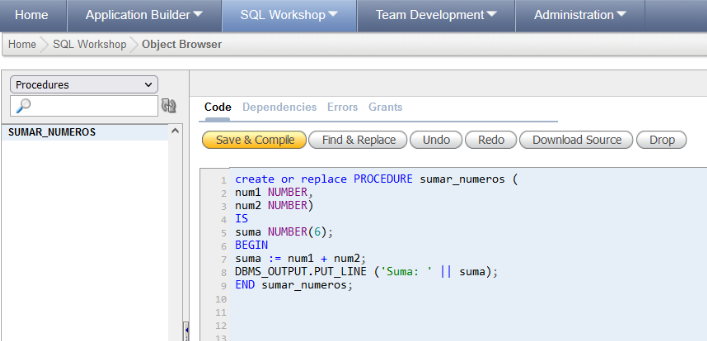
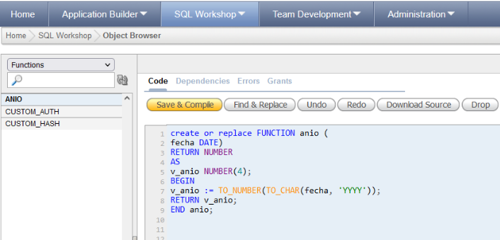
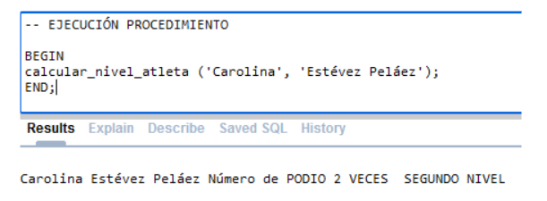
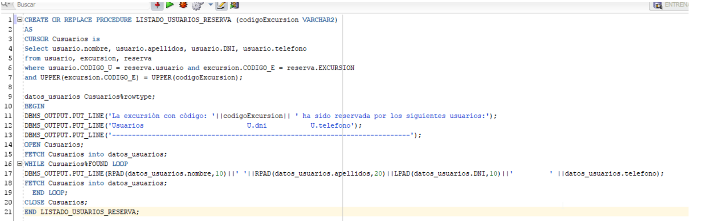
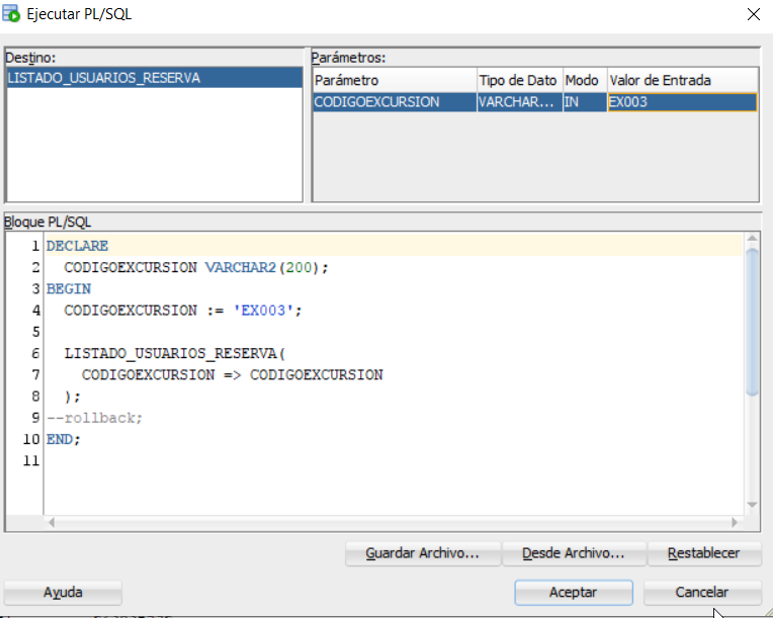
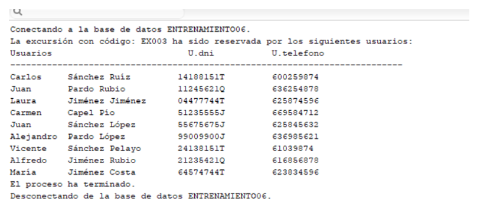
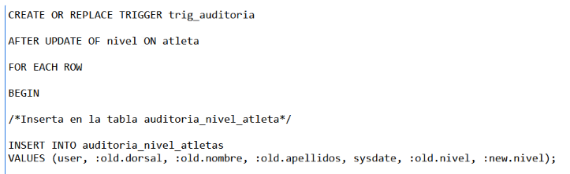

# PL/SQL

## Operadores

|Operador|Sintaxis|Ejemplo|
|---|:---:|-|
|Asignación |`:=`| `num := 12`|
||||
|Suma |`+`|``num + 1``|
|Resta |`-`|`num - 1`|
|Multiplicación |`*`|`num * 2`|
|División |`/`|`num / 2`|
|Exponente |`**`|`num ** 3`|
||||
|Igual que |`=`|`num = 3`|
|Distinto de |`<>`|`num <> 3`|
|Menor que |`<`|`num < 3`|
|Mayor que |`>`|`num > 3`|
|Menor igual que |`<=`|`num <= 3`|
|Mayor igual que |`>=`|`num >= 3`|
||||
|Concatenación |`\|\|`|`"Num: " \|\| num`|

## Tipos de datos

``CHARACTER`` 🡪 Caracter.

``VARCHAR`` 🡪 Cadena de caracteres.

``DATE`` 🡪 Fechas y horas.

``NUMBER`` 🡪 Numeros enteros, decimales; positivos o negativos.

``NATURAL`` 🡪 Numeros enteros positivos.

> [!IMPORTANT]  
> No existe ``TIME``. En su lugar, se usa ``DATE``, que es una concatenación de la fecha + la hora, a la que posteriormente tendremos que “recortar” la fecha para poder dejar la hora.

Para agregar comentarios en nuestro código de PL se utiliza doble guión (`--`) para los comentarios en línea y para el comentario en bloque utilizamos `/* ... */` :

```sql
-- Esto es un comentario en línea

/*

Esto es un 
comentario  
en bloque 
:D

*/
```

**Estructura general:**

```sql
[DECLARE
 [Declaración de variables, constantes, cursores y excepciones]]
BEGIN
[Sentencias ejecutables]
[EXCEPTION
 Manejadores de excepciones]
END;
```

**Impresión por pantalla:**

<!-- _Para imprimir por pantalla se utiliza:_ -->

```sql
DBMS_OUTPUT.PUT_LINE("Hola Mundo!");

-- Se mostraría:   Hola Mundo!
```

## Procedimientos

**CREAR UN PROCEDIMIENTO**:

En un procedimiento se realiza una salida por pantalla.

```sql
CREATE OR REPLACE PROCEDURE sumar_numeros (
  num1 NUMBER,
  num2 NUMBER)

IS
  suma NUMBER(6);

BEGIN
  suma := num1 + num2;
  DBMS_OUTPUT.PUT_LINE('Suma: '|| suma);

END sumar_numeros;


/*
En los parámetros que tiene "sumar_numeros" se hace la declaración de cada variable y actúan como parámetros de entrada.

Después del IS se declara la variable suma con (6) para indicar la longitud.

Después del BEGIN se aplica el cálculo que se va a realizar. Es importante poner ":=" para guardar los valores en la variable.

La tubería que se pone es para concatenar en la salida

Finalmente se pone END con el nombre del procedimiento.
*/

```

Dentro de Object Browser podemos elegir, en el desplegable, el apartado “Procedures” donde podemos ver todos los procedimientos que hemos creado. En este caso, “sumar_numeros”. Así se ve:



**EJECUTAR PROCEDIMIENTO:**

```sql
-- Ejecución del procedimiento
BEGIN
 SUMAR_NUMEROS(4, 3); → No hay distinción de mayúsculas y minúsculas.
END;
```

## Funciones

**CREAR UNA FUNCIÓN:**

Las funciones llevan **RETURN** para que te devuelva un valor pero no lo muestra por pantalla. Cada vez que se ejecute la función, hará los cambios repentinos en la base de datos.

```sql
CREATE OR REPLACE FUNCTION anio(
fecha DATE)
RETURN NUMBER
AS
v_anio NUMBER(4);
BEGIN
v_anio := TO_NUMBER(TO_CHAR(fecha, 'YYYY'));
RETURN v_anio;
END anio;

# En el parámetro de anio se declara la variable
# A continuación en el RETURN se indica lo que va a devolver, en este caso un NUMBER
# AS → Aunque AS e IS hacen lo mismo, suele usarse IS para números y AS para fechas
# TO_NUMBER para formato número y TO_CHAR para formato fecha y lo que hay en el paréntesis se pone ‘YYYY’ para que coja el número, por lo que finalmente será un número, ya que siempre se ejecuta de “dentro a fuera”
```

Dentro de Object Browser podemos elegir, en el desplegable, el apartado “Functions” donde podemos ver todos las funciones que hemos creado. En este caso, “anio”. Así se ve:



Para una "impresión por pantalla" debemos realizar lo siguiente:

```sql
BEGIN
DBMS_OUTPUT.PUT_LINE('Año: '|| anio('2023-03-13'));
```

***ABS** → devuelve el valor absoluto (quita el signo) de un número.*

***ABS(TRUNC(MONTHS_BETWEEN(fecha2, fecha1) / 12))** → sirve para restar fechas y sacar la cantidad de meses que hay entre fecha2 y fecha1. Al dividir entre 12 sacamos los años exactos que hay entre fecha 2 y fecha 1, ya que estamos haciendo un TRUNC.\*

_¡¡Si no hay carga de SQL, la fecha por DEFECTO es MM/DD/YYYY!!_

_Ejemplos:_

> Escribir una función que devuelva solamente caracteres alfabéticos sustituyendo cualquier otro carácter por blancos a partir de una cadena que se pasará en la llamada. (Es decir, todo lo que sea número, me lo cambia por espacio en blanco).

*Hay que usar, por ejemplo, un bucle **FOR***:

```sql
CREATE OR REPLACE FUNCTION sustitucion(
cadena VARCHAR2)
RETURN VARCHAR2
AS
nuevaCadena VARCHAR2;
caracter CHARACTER;
BEGIN
FOR i IN 1.. LENGTH(cadena) LOOP
caracter := SUBSTR(cadena, i, 1);
IF (ascii(caracter) NOT BETWEEN 65 and 90)
AND (ascii(caracter) NOT BETWEEN 97 and 122) THEN
caracter := ‘ ‘;
END IF;
nuevaCadena := nuevaCadena || caracter;
END LOOP;
RETURN nuevaCadena;
END;

# La "i" es para la primera posición que encuentre hasta el final
```

> Codificar un procedimiento que reciba una cadena y la visualice al revés.

```sql
CREATE OR REPLACE PROCEDURE cadenaInversa (
cadena VARCHAR2)
AS
cadenaInvertida VARCHAR2(30);
BEGIN
FOR i IN REVERSE 1.. LENGTH(cadena) LOOP
cadenaInvertida:= cadenaInvertida || SUBSTR (cadena, i, 1);
END LOOP;
DBMS_OUTPUT.PUT_LINE (cadenaInvertida);
END;

# En este FOR hay que usar un REVERSE para empezar el bucle desde el final
```

_Cuando creamos una función, ésta se puede meter dentro de un procedimiento, con el objetivo de amenizar código y ahorrarnos líneas de código._

Si creo una función como la siguiente:

```sql
CREATE OR REPLACE FUNCTION sustitucion (
cad VARCHAR2)
RETURN VARCHAR2
AS
nueva_cad VARCHAR2(30);
car CHARACTER;
BEGIN
FOR i IN 1..LENGTH(cad) LOOP
car := SUBSTR(cad, i, 1);
IF (ASCII(car) NOT BETWEEN 65 AND 90)
AND (ASCII (car) NOT BETWEEN 97 AND 122) THEN
car :=' ';
END IF;
nueva_cad := nueva_cad || car;
END LOOP;
RETURN nueva_cad;
END sustitucion;
```

Esta función consiste en ‘Limpiar’ una cadena dejándola sólo con letras tanto minúsculas como mayúsculas. Limpia de números, y otros caracteres.

Si creo un procedimiento como el siguiente:

```sql
CREATE OR REPLACE PROCEDURE cadenasEspaciosProcedimiento(
cadena VARCHAR2 )
IS
BEGIN
DBMS_OUTPUT.PUT_LINE('Cadena original: ' || cadena);
DBMS_OUTPUT.PUT_LINE('Cadena sin caracteres que no sean letras: ' ||
sustitucion(cadena));
END cadenasEspaciosProcedimiento;

# Podemos ver como llamamos a la función que previamente hemos creado (sustitucion)
```

Este procedimiento lo que hace es aceptar una palabra y lo que hace es aplicar la función de limpiarla para que nos muestre finalmente la cadena original y la cadena sin caracteres que no sean letras.

De tal modo que la ejecución del procedimiento quedaría de la siguiente manera:

```sql
BEGIN
cadenasEspaciosProcedimiento('Juan213Antonio321');
END;
```

> Crea un procedimiento que reciba como parámetros el nombre y apellidos de un atleta. El procedimiento debe calcular el nivel del atleta que puede ser: Primer nivel, Segundo nivel ó Tercer nivel. Para ello si el atleta ha obtenido 3 o más podio será de Primer nivel, si ha obtenido al menos 1 podio será de segundo nivel y en otro caso será de Tercer Nivel.
>
> El procedimiento debe actualizar el campo “nivel” de la tabla atleta (siempre y cuando el nivel del atleta sea distinto al anterior nivel que tuviera) y debe mostrar por pantalla el número de podios obtenidos por el atleta y el nivel.

```sql
CREATE OR REPLACE PROCEDURE calcular_nivel_atleta (nombre_atleta VARCHAR2, apellidos_atleta VARCHAR2)
AS
# Declaración de variables
num_veces NUMBER;
dorsal_atleta VARCHAR2(6);

BEGIN

# Lo primero que hacemos es calcular el número de veces que el atleta ha hecho podio
# EL UPPER ES PARA QUE LIMPIE LOS ACENTOS Y LO PASE TODO A MAYUSCULAS PARA QUE COINCIDA
# Into para introducir el dato de la tabla en la variable de nuestro procedimiento
# <> significa “lo contrario a”

SELECT dorsal into dorsal_atleta FROM ATLETA WHERE UPPER(nombre) = UPPER(nombre_atleta) AND UPPER(apellidos) = UPPER(apellidos_atleta);

SELECT count(*) into num_veces FROM COMPETIR WHERE dorsal_atl = dorsal_atleta and posicion IN (1,2,3);

#Ahora, en función del número de podio conseguidos calculamos su nivel
      IF (num_veces >= 3) THEN
        DBMS_OUTPUT.PUT_LINE (nombre_atleta || ' ' || apellidos_atleta || ' ' || ' Número de PODIO ' || num_veces || ' VECES ' || ' PRIMER NIVEL');

        UPDATE ATLETA SET nivel = 'PRIMER NIVEL' WHERE dorsal_atleta = dorsal AND nivel <> 'PRIMER NIVEL';

      ELSE IF (num_veces >= 2) THEN
        DBMS_OUTPUT.PUT_LINE (nombre_atleta || ' ' || apellidos_atleta || ' ' || ' Número de PODIO ' || num_veces || ' VECES ' || ' SEGUNDO NIVEL');

        UPDATE ATLETA SET nivel = 'SEGUNDO NIVEL' WHERE dorsal_atleta = dorsal AND nivel <> 'SEGUNDO NIVEL';

      ELSE
        DBMS_OUTPUT.PUT_LINE (nombre_atleta || ' ' || apellidos_atleta || ' ' || ' Número de PODIO ' || num_veces || ' VECES ' || ' TERCER NIVEL');

        UPDATE ATLETA SET nivel = 'TERCER NIVEL' WHERE dorsal_atleta = dorsal AND nivel <> 'TERCER NIVEL';

      END IF;

END calcular_nivel_atleta ;
```



## Cursor

Cuando hagamos cursores (que se usan en PROCEDIMIENTOS), se pone antes del BEGIN, y dentro del cursor va la consulta.

*Ejemplo:*
> Crear un procedimiento que reciba como parámetro el código de la excursión y muestre por pantalla un listado con todos los usuarios que han reservado esa excursión. Debe mostrar el nombre y apellido de los distintos usuarios así como el DNI y teléfono.

```sql
CREATE OR REPLACE PROCEDURE LISTADO_USUARIOS_RESERVA (codigoExcursion VARCHAR2)
AS 
CURSOR Cusuarios is
Select usuario.nombre, usuario.apellidos, usuario.DNI, usuario.telefono
from usuario, excursion, reserva
where usuario.CODIGO_U = reserva.usuario and excursion.CODIGO_E = reserva.EXCURSION
and UPPER(excursion.CODIGO_E) = UPPER(codigoExcursion);

datos_usuarios Cusuarios%rowtype;
BEGIN
DBMS_OUTPUT.PUT_LINE('La excursión con código: '||codigoExcursion|| ' ha sido reservada por los siguientes usuarios:');
DBMS_OUTPUT.PUT_LINE('Usuarios                          U.dni           U.telefono');
DBMS_OUTPUT.PUT_LINE('---------------------------------------------------------------------------');
OPEN Cusuarios;
FETCH Cusuarios into datos_usuarios;
WHILE Cusuarios%FOUND LOOP
DBMS_OUTPUT.PUT_LINE(RPAD(datos_usuarios.nombre,10)||' '|| RPAD(datos_usuarios.apellidos,20)||LPAD(datos_usuarios.DNI,10)||'         ' ||datos_usuarios.telefono);
FETCH Cusuarios into datos_usuarios;
  END LOOP;
CLOSE Cusuarios;
END LISTADO_USUARIOS_RESERVA;

# RPAD y LPAD se utilizan como función en el cual tiene como parámetro lo que queremos introducir y luego un número que serán los espacios que queremos poner. Si es a la izquierda se utiliza LPAD y si es a la derecha RPAD
```





## Triggers

Se usa como disparador, es decir, cuando se ejecute una sentencia, “se dispara” una acción.

Los disparadores son BEFORE o AFTER, ya que puede ser lanzado antes de la sentencia o después.

Cuando insertemos datos nuevos, vamos a trabajar ahora con dos formas nuevas de sentencia, que son → :old y :new

*Ej:*

:old.nivel, que nos sirve para coger los valores de nivel que había antes.

:new.nivel, que nos sirve para coger los valores del nivel una vez actualizado.

*Ejemplo:*

> Crear un disparador(trigger) que almacene en una tabla, llamada AUDITORIA_NIVEL_ATLETAS, los calores: usuario (con el que estamos autitenticados en Oracle), dorsal, nombre, apellidos, fecha en la que se produce la actualización del nivel de atleta, nivel anterior, nivel posterior. Ese disparador se disparará cuando se detecte una modificación en el campo "nivel" de la tabla ATLETA.



> Crear un disparador (trigger) que cada vez que se inserte o actualice un registro en la tabla INCIDENCIA con el valor del campo "estado"='Finalizado' se actualice el campo "puntos acumulados" de la tabla USUARIO sumando a este campo el valor del campo "puntos_coste".

```sql
CREATE OR REPLACE TRIGGER actualiza_estado

AFTER INSERT OR UPDATE ON INCIDENCIA

FOR EACH ROW
DECLARE
BEGIN

IF:new.estado='Finalizado'THEN
  UPDATE USUARIO SET puntos_acumulados=puntos_acumulados + :new.puntos_coste WHERE (:new.num_repara=numero);
END IF;

EXCEPTION
  WHEN OTHERS THEN
  RAISE_APPLICATION_ERROR(-10001,'Error en la auditoria');
END;
```
